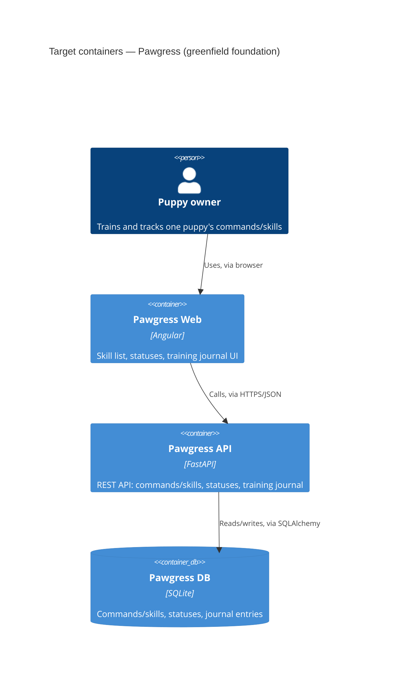

# Architecture map — Pawgress

> **Greenfield bootstrap.** The repo is currently empty (only `docs/idea-brief.md`); everything
> below is the **target foundation** chosen with the owner, to be materialized by `/sdd:scaffold`.
> This is not a scan of existing code — it is the baseline every feature builds into. Refresh via
> `survey` once real code exists and this map needs to describe reality instead of intent.

## Stack

- Language / runtime: Python 3.12 (backend), TypeScript + Angular (frontend)
- Frameworks: FastAPI (HTTP API), SQLAlchemy (ORM), Pydantic (schemas/validation), Alembic (migrations), Angular CLI (standalone components, no NgModules)
- Build / test / lint: `pip install -e .[dev]` + `npm ci` to build; `pytest` for the backend smoke test; no unit/integration test suite or lint command decided yet — deliberately deferred for MVP speed (see Constraints below)

## C4 — system as it is

## Module inventory

| Module | Path | Layers | Wired at | Responsibility |
|---|---|---|---|---|
| backend api | `backend/app/api/` | api | `backend/app/main.py` | FastAPI routers — HTTP boundary |
| backend services | `backend/app/services/` | app | `backend/app/api/` (called by routers) | business logic — status transitions, journal aggregation |
| backend repositories | `backend/app/repositories/` | infra | `backend/app/services/` (called by services) | SQLAlchemy queries, no business logic |
| backend models | `backend/app/models/` | infra | `backend/app/repositories/` | SQLAlchemy ORM models |
| backend schemas | `backend/app/schemas/` | api | `backend/app/api/` | Pydantic request/response shapes |
| backend core | `backend/app/core/` | infra | imported repo-wide | config, DB session, error envelope, ID generation |
| frontend core | `frontend/src/app/core/` | app-shell | `frontend/src/app/app.config.ts` | HTTP client setup, app-wide singletons |
| frontend shared | `frontend/src/app/shared/` | ui | imported by features | reusable components/pipes, no feature-specific logic |
| frontend features | `frontend/src/app/features/` | ui | `frontend/src/app/app.routes.ts` | one folder per feature (skills, journal), standalone components |

## Conventions (cited — the rules a new feature must match)

<!-- target conventions: repo is empty, so these are the rules `scaffold` materializes and every
future feature must follow — not yet backed by real file citations until scaffold runs. -->

- **Module wiring / registration:** FastAPI routers included in `backend/app/main.py`; Angular routes declared in `frontend/src/app/app.routes.ts` (standalone components, lazy-loaded per feature)
- **Error handling:** unified JSON error envelope `{"error": {"code", "message", "details"}}`, raised via FastAPI exception handlers in `backend/app/core/errors.py`
- **IDs:** app-generated ULID strings as primary keys, generated in `backend/app/core/ids.py` before insert — never DB auto-increment
- **Persistence / DB access:** repositories wrap SQLAlchemy sessions; services never import SQLAlchemy directly; SQLite as dumb storage (no triggers/stored logic)
- **Migrations:** Alembic, versioned scripts under `backend/migrations/versions/`
- **Tests:** MVP deliberately ships with only a structural smoke test (`backend/tests/test_smoke.py` — app boots + migrations apply/revert); a real unit/integration test convention is an open decision, not yet fixed (see Constraints)
- **Inter-module communication:** direct in-process function calls — single backend service, no messaging/events at this stage
- **UI / styling:** Angular standalone components, component-scoped SCSS, no third-party UI kit for MVP — run `/sdd:design-system` later if a shared component library becomes worth formalizing

## Datastores

| Store | Engine | Accessed via | Notes |
|---|---|---|---|
| Pawgress DB | SQLite | SQLAlchemy (via `backend/app/repositories/`) | single file, no separate dev/prod DB engine decided yet |

## Frontend / UI foundation

- **Component library / design system:** none yet — plain Angular standalone components; revisit with `/sdd:design-system` once there's more than one feature's worth of UI
- **Design tokens:** not yet defined — no token source exists at this stage
- **Styling approach:** component-scoped SCSS (Angular's default `styleUrl` per component), no Tailwind/CSS-in-JS
- **Shared primitives:** none yet — `frontend/src/app/shared/` is the target home for the first reusable components once a second feature needs them
- **State / data-fetching:** Angular `HttpClient` directly from feature services, no dedicated state library for MVP
- **Closest UI precedent:** none yet — the first feature (skills list) sets the pattern subsequent features copy

## Where things live / closest precedents

- A new backend feature → `backend/app/{api,services,repositories,models,schemas}/<feature>.py`, following the layered pattern above (no precedent yet — this is the first feature).
- A new screen / UI component → `frontend/src/app/features/<feature>/`, composed from `frontend/src/app/shared/` once shared components exist; standalone component + routed via `app.routes.ts`.

## Constraints & known tech-debt

- **No test-suite convention beyond the skeleton smoke test.** The owner chose to defer unit/integration test strategy and CI to move fast on the MVP — `implement` should not assume a test harness exists beyond `backend/tests/test_smoke.py`; `plan-tests` will need to fix a real convention before feature-level TDD can run meaningfully.
- **No CI workflow.** Builds/tests/lint run locally only until the owner decides to add one — no automated gate on pushes yet.
- **No UI design system.** Every screen is built ad hoc in plain Angular until `/sdd:design-system` is run — expect visual inconsistency across early features until then.

## Reconciliation with the authored architecture doc

No authored architecture doc exists (no `docs/architecture.md`, `ARCHITECTURE.md`, or root `CLAUDE.md`) — this map is the current (target) reference. `docs/idea-brief.md` was read as the source of intent (backend: FastAPI/SQLite, frontend: Angular) and is reflected above.
