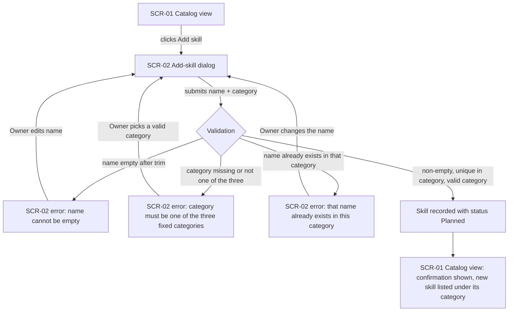
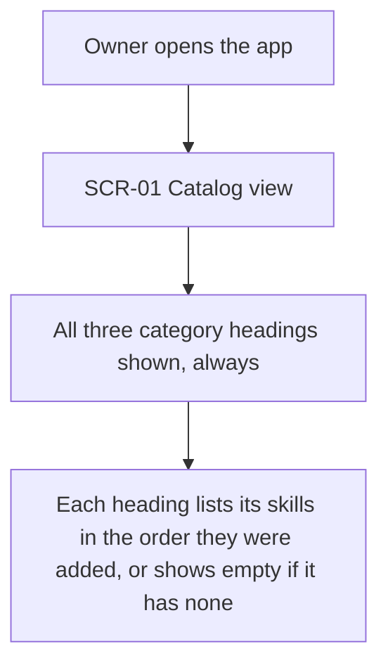

# UX flows — skill-catalog

> User flows for every UI-touching §4 user story, produced by `ux-flows` (after `clarify`, before
> `design`) and read by `design` (evidence for the target-surface + UI-architecture decisions),
> `sequences` (UI-driven flows align on SCR ids), `screens` (details every inventory row) and
> `plan-tests` (the e2e-through-UI paths). **Always markdown + mermaid `flowchart`**, whatever the
> design tool — this artifact is flow-altitude, not visual design.

## Platform decisions

- **Posture:** responsive-both — `docs/design-system.md` does not exist yet for this repo, so this
  is a per-feature deviation, confirmed with the Owner: the Owner may use the catalog from a phone
  during a walk or from a computer at home, so flows assume the UI adapts to either, with no layout
  fixed to one screen size. Revisit once `/sdd:design-system` is run and fixes a project-wide
  posture.
- **Modality — Add skill is a same-screen dialog, not a separate page or a wizard:** the form has
  exactly two fields (name, category), so opening it as an inline dialog over the catalog view
  keeps the Owner's place in the list and avoids a page round-trip for a two-field submission.
  Every validation error (AC-02, AC-03, AC-07) re-shows the same dialog with a message — it never
  navigates to a distinct error screen.
- **Navigation shape:** one root screen (the catalog) with the Add-skill dialog as its only
  overlay — no multi-step flow, no deep linking needed for this slice.

## Screen inventory

| ID | Screen | Purpose | Entry | Exit |
|---|---|---|---|---|
| SCR-01 | Catalog view | Shows all three category headings, each with its skills in add-order | App launch; also where the Owner returns to after adding a skill or canceling | Opens SCR-02 via "Add skill" |
| SCR-02 | Add-skill dialog | Lets the Owner submit a name + category for one new skill, and shows why a submission was rejected | Opened from SCR-01 via "Add skill" | Back to SCR-01, either on success (skill recorded) or on cancel (no change) |

## Flows

### Flow: US-01 — Add a skill

> Covers US-01 (happy path), US-03 (duplicate-name rejection) and US-04 (empty-name and
> invalid-category rejection) in one flow — all three stories describe the same single
> interaction (submitting the Add-skill dialog), just naming different branches of it. Drawing
> them as three near-identical diagrams would repeat the same two screens three times; this one
> flow shows every branch [assumption, see ledger below].

The Owner opens the Add-skill dialog from the catalog and submits a name and a category. Three
things can go wrong, each re-showing the same dialog with a specific message instead of losing the
Owner's place: the name is empty once whitespace is trimmed (AC-02), the category isn't one of the
three fixed values (AC-07), or the name is an exact duplicate of one already in that category after
trimming (AC-03) — the Owner corrects the offending field and resubmits from the same dialog. When
none of these hold, the system records the skill with its starting status, Planned (AC-05), confirms
it to the Owner, and the catalog view shows it under its category heading (AC-01).

### Flow: US-02 — View catalog grouped by category

Opening the app always shows all three category headings — Basic, Household, Socialization —
whether or not each one has any skills yet; every skill already in the catalog appears under its
category in the order it was added, with no paging (AC-06).

### Out of scope for a dedicated flow

- **US-05 (Trust catalog is exclusively mine)** — not drawn as a flow: this slice has exactly one
  Owner and exactly one catalog with no way to address another, so there is no screen, no decision
  node, and no branch where a second catalog could be shown or edited — nothing for a flowchart to
  depict. AC-04 is marked N/A in the coverage table below for the same reason.
- **US-06 (New skill is ready for status-tracking)** — not a separate flow: assigning the starting
  status Planned is a system-side effect of the Add-skill happy path (node G in the US-01 flow
  above), not a distinct screen or user action of its own.

## AC coverage

| AC | Shown by | Notes |
|---|---|---|
| AC-01 | Flow US-01 → node G→H (happy path) | Skill recorded, confirmed, appears under its category |
| AC-02 | Flow US-01 → branch C→D | Empty-name-after-trim rejection |
| AC-03 | Flow US-01 → branch C→F | Duplicate-name-in-category rejection |
| AC-04 | N/A: no UI decision point | Single implicit Owner/catalog invariant — nothing to branch on (see "Out of scope" above) |
| AC-05 | Flow US-01 → node G | Status set to Planned as part of the happy-path recording step |
| AC-06 | Flow US-02 → nodes C→D | Three headings always shown, populated or empty, in add-order |
| AC-07 | Flow US-01 → branch C→E | Invalid/missing-category rejection |
