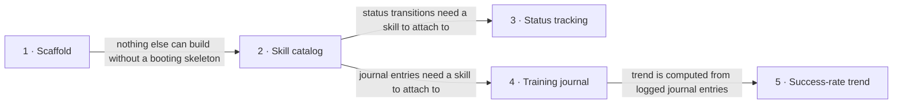

# Roadmap — Pawgress

> **A decomposition, not a promise.** The overall idea broken into incremental steps: what each
> step is, where it comes from, how big it is — or that nobody has looked at it yet — and in which
> order, and parallel lanes, we walk them. **No dates** (except shipped history), **no scores** —
> order is the prioritization. The *solution* for any step lives in its `docs/features/<slug>/`
> spec, not here.

## Destination

A single owner can list every command/skill they want their puppy to learn across three fixed categories, track each one's status back and forth through a training funnel, log training sessions per skill, and see an auto-computed success-rate trend for each one.

## Steps

| # | Step | Source | Size | Status |
|---|---|---|:---:|---|
| 1 | Scaffold the project skeleton (backend + frontend build/boot) | `architecture-map.md` (mode: greenfield-bootstrap) | S | idea |
| 2 | Skill/command catalog — add and list commands/skills under the three fixed categories | `idea-brief.md §1 Raw idea`, `§7 Recommendation` | S | idea |
| 3 | Skill status tracking — move a skill's status forward or backward through the four-stage funnel | `idea-brief.md §6 Risks` | XS | idea |
| 4 | Training journal — log a training session (date, successful/total attempts, comment) per skill | `idea-brief.md §1 Raw idea`, `§7 Recommendation` | S | idea |
| 5 | Success-rate trend — auto-computed per-skill percentage derived from the training journal | `idea-brief.md §7 Recommendation`, `§8 Open questions` | XS | idea |

## Not yet specified

<!-- none — every step above was precisely stateable at this pass -->

## Out of scope

- Command/skill ordering or prerequisites (a training-plan sequence) — `idea-brief.md §5 Out of scope`.
- Multi-pet support — `idea-brief.md §5 Out of scope`.
- Custom/user-defined categories — `idea-brief.md §5 Out of scope`.
- Starter command templates / suggested library — `idea-brief.md §5 Out of scope`.
- Multi-user / shared household tracking — `idea-brief.md §5 Out of scope`.
- CI workflow and a full unit/integration test-suite convention — deferred by the owner during `survey` for MVP speed; see `architecture-map.md` Constraints.

## Open decisions

| # | Question | Type | Owner | Blocks |
|---|---|:---:|:---:|:---:|
| D1 | Should the success-rate trend (step 5) be a simple all-time aggregate or a rolling/time-windowed trend? | grilling | human | 5 |
| D2 | What happens to a skill's journal history and success-rate data when its status regresses (step 3) — kept as-is, annotated, or reset? | grilling | human | 3, 5 |

## Decisions so far

- Stack: Python/FastAPI + Angular, monorepo (`backend/` + `frontend/`) → [`adr/0001-choose-python-fastapi-angular-stack.md`](adr/0001-choose-python-fastapi-angular-stack.md)
- Backend architecture: layered `api → services → repositories → models` → [`adr/0002-use-layered-backend-architecture.md`](adr/0002-use-layered-backend-architecture.md)
- Persistence: SQLite + Alembic + app-generated ULID primary keys → [`adr/0003-use-sqlite-alembic-ulid-persistence.md`](adr/0003-use-sqlite-alembic-ulid-persistence.md)
- Journal entries record both successful and total attempts (not a single unqualified count) → [`idea-brief.md §6 Risks`](idea-brief.md)
- Status can move backward, not just forward → [`idea-brief.md §6 Risks`](idea-brief.md)
- Tests and CI deliberately deferred for MVP speed; only a structural smoke test ships with the skeleton → [`architecture-map.md`](architecture-map.md)

## Dependency graph

## Execution path

| Wave | Steps | Zone per step (why parallel-safe) | Unlocks |
|:---:|---|---|---|
| 1 | 1 | whole repo `(new)` | 2 |
| 2 | 2 | `backend/app/{api,services,repositories,models,schemas}/skills.py` + `frontend/src/app/features/skills/` `(new)` | 3, 4 |
| 3 | 3 ∥ 4 | 3: skills module — status sub-resource `(new, extends step 2's files)` · 4: `backend/app/{api,services,repositories,models,schemas}/journal.py` + `frontend/src/app/features/journal/` `(new, disjoint files)` | 5 |
| 4 | 5 | journal module — stats extension + skill detail view `(new)` | — |

## Shipped

<!-- none yet -->

| Step | Shipped | Link |
|---|---|---|
